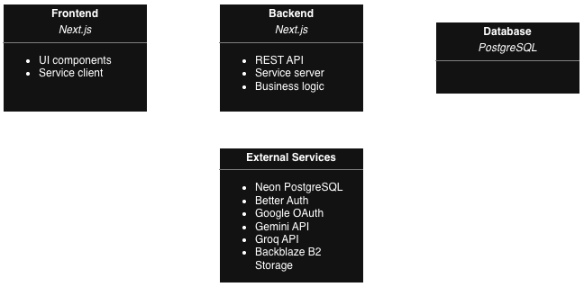
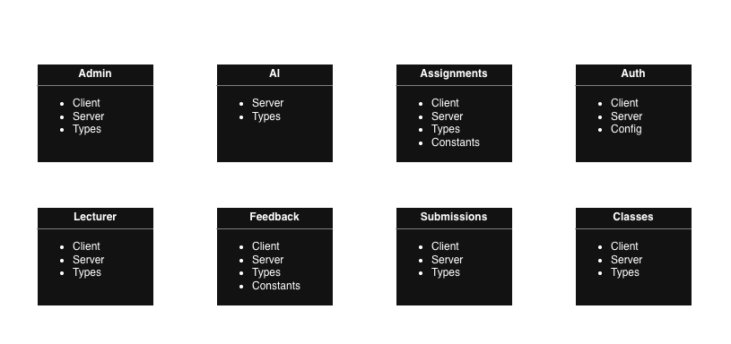
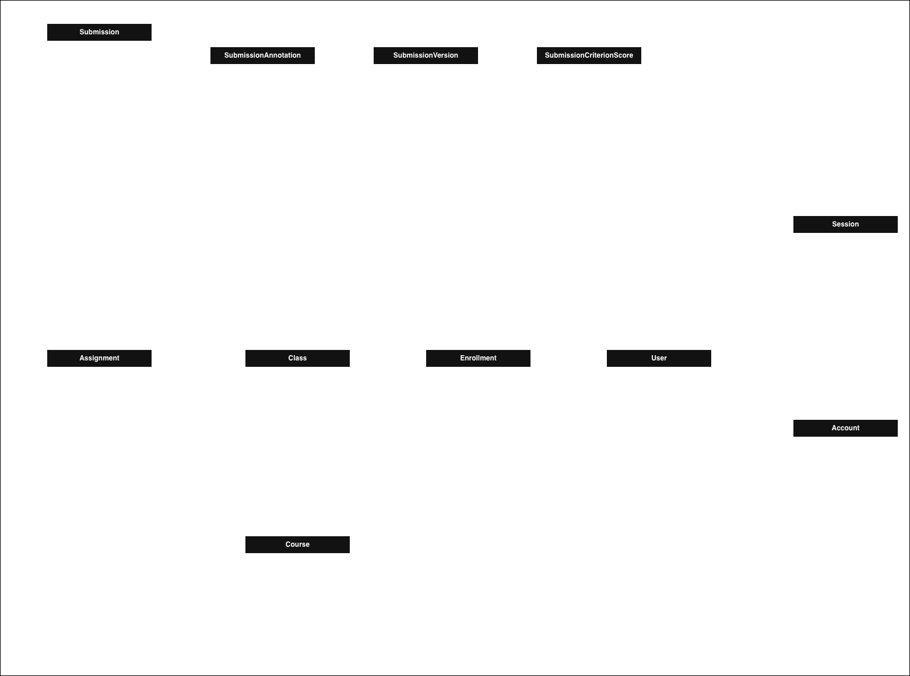

# Project Report  
Course Code: COMP6703001  
Course Name: Web Application Development and Security  
Institution: BINUS University International  

## 1. Project Information

**Project Title:** Markify  
**Project Domain:** Interactive Essay Grading Application  
**Class:** L4BC  

### Group Members

| Name | Student ID | Github Username |
|------|------------|----------------|
| Juan Felix Kusnadi | 2802536386 | juanfelixk |
| Jonathan Mulyono | 2802537054 | jomul-ai |
| Iglesias Sidharta Handojo | 2802530621 | iglesias123 |

## 2. Respository Access
This repository has been shared with Ida Bagus Kerthyayana Manuaba (bagzcode) and Juwono (Juwono136).

## 3. Project Overview

### 3.1 Problem Statement

Traditional essay grading in academic settings is a slow, labor-intensive process that often leaves students waiting days or even weeks for feedback. Current tools in the market, such as Turnitin, address academic integrity through plagiarism detection but do not support the quality of student writing or facilitate productive revision. Lecturers are still burdened with reviewing every submission manually, providing written feedback, and managing multiple submission rounds all with limited tooling to streamline the process. Markify addresses this gap by transforming essay grading from a static, end-point evaluation into a structured, AI-assisted revision cycle.

Markify serves two primary user groups within higher education institutions, which are students and lecturers. Students who need timely, actionable feedback on their essays to understand their weaknesses and improve their writing before a final grade is recorded, and lecturers who need an efficient, organized platform to manage submissions, track student revision progress, and make final grading decisions without being overwhelmed by manual review.

### 3.2 Solution Overview

Markify provides an end-to-end essay submission and grading platform. Its core features include:

- Essay Submission Portal: Students submit essays through a structured interface tied to specific assignments and deadlines set by their lecturer.  
- AI-Powered Scoring and Feedback: Upon each submission, the system automatically evaluates the essay and generates a score along with detailed, criterion-based feedback covering areas such as argument clarity, structure, grammar, and coherence.  
- Revision Cycle Management: Students can review their AI feedback and resubmit improved versions within a defined revision window, allowing them to iterate and grow before final grading.  
- Lecturer Dashboard: Lecturers receive a view of all student submissions, AI scores, and revision histories, enabling them to make faster and more informed final grading decisions.

Markify is well-suited to the problem because it meets the needs of both sides of the academic grading relationship. Students benefit from instant feedback that empowers self-improvement, while lecturers benefit from reduced manual workload and better visibility into student effort and progress. Unlike generic writing assistants, Markify is purpose-built for academic assessment workflows, with submission management, revision cycles, and grading all integrated into a single platform.

## 4. Technology Stack

| Layer | Technology |
|------|-----------|
| Frontend | Next.js |
| Backend | Next.js |
| API | REST API |
| Database | PostgreSQL |
| Containerization | Docker |
| Deployment | csbiweb |
| Version Control | Github |

## 5. System Architecture

### 5.1 Architecture Diagram

### 5.2 Architecture Explanation

Markify follows a modular monolith architecture consisting of a frontend layer, backend API layer, service layer, and database layer. Users interact with the application through web pages and forms for authentication, essay submission, grading, and feedback viewing. Frontend components communicate with the backend through service client functions that send HTTP requests to API endpoints. The API layer acts as an entry point for all requests. API routes receive requests from the frontend, validate input data, verify authentication status, and forward the requests to the appropriate service module. The service layer contains the core business logic of the system. These services interact with external providers such as Gemini and Groq for AI-based grading and feedback generation. The database layer uses PostgreSQL hosted on Neon. Data access is performed through Prisma ORM, which handles database queries and persistence.

### 5.3 Security Implementation

Authentication is handled using Better Auth with Google OAuth integration. Protected API routes verify user identity before granting access to application resources.  
The database is not directly accessible from the frontend. All database interactions occur through backend service modules and Prisma ORM.  
Essay files are uploaded through authenticated backend processes and stored in Backblaze B2 cloud storage. Direct access to storage credentials is never exposed to the client.  
Sensitive credentials such as connection strings and API keys are stored in environment variables and are only accessible on the server side.

## 6. API Design

### 6.1 API Endpoints

| Method | Endpoint | Description | Auth Required |
|--------|----------|-------------|--------------|
| GET | /api/v1/admin/course/{courseId}/class | Retrieve all classes associated with a course | Yes |
| PATCH | /api/v1/admin/course/{courseId} | Update an existing course | Yes |
| POST | /api/v1/admin/course | Register a new course | Yes |
| GET | /api/v1/admin/course | Get all courses | Yes |
| POST | /api/v1/admin/invitation | Register a new lecturer | Yes |
| GET | /api/v1/admin/lecturer/{lecturerId}/class | Get a lecturer’s classes | Yes |
| GET | /api/v1/admin/lecturer | Get all lecturers | Yes |
| GET | /api/v1/admin/student/{studentId}/enrollment | Get enrolled classes for a student | Yes |
| GET | /api/v1/admin/student | Get all students | Yes |
| POST | api/v1/auth/reset-password/questions | Get user security questions for password reset | No |
| POST | api/v1/auth/reset-password | Reset user password | No |
| GET | api/v1/lecturer/class/{classId}/assignment/{assignmentId}/grading/{submissionId}/file | Get student submission file URL | Yes |
| GET | api/v1/lecturer/class/{classId}/assignment/{assignmentId}/grading/{submissionId} | Get grading page data | Yes |
| PATCH | api/v1/lecturer/class/{classId}/assignment/{assignmentId}/grading/{submissionId} | Save grade | Yes |
| POST | api/v1/lecturer/class/{classId}/assignment/{assignmentId}/publish | Publish grade | Yes |
| GET | api/v1/lecturer/class/{classId}/assignment/{assignmentId} | Get assignment details | Yes |
| PATCH | api/v1/lecturer/class/{classId}/assignment/{assignmentId} | Update assignment details | Yes |
| DELETE | api/v1/lecturer/class/{classId}/assignment/{assignmentId} | Delete assignment | Yes |
| GET | api/v1/lecturer/class/{classId}/assignment/{assignmentId}/submission/{studentId}/file | Get student submission file | Yes |
| POST | api/v1/lecturer/class/{classId}/assignment | Create a new assignment | Yes |
| GET | api/v1/lecturer/class/{classId} | Get class details | Yes |
| DELETE | api/v1/lecturer/class/{classId} | Delete class | Yes |
| GET | api/v1/lecturer/class | Get classes | Yes |
| POST | api/v1/lecturer/class | Create new class | Yes |
| GET | api/v1/lecturer/course | Get available courses | Yes |
| GET | /api/v1/student/calendar | Get student calendar | Yes |
| GET | /api/v1/student/class/{classId}/assignment/{assignmentId} | Get assignment details | Yes |
| GET | /api/v1/student/class/{classId}/assignment | Get assignments in a class | Yes |
| GET | /api/v1/student/class/{classId}/assignment/{assignmentId}/file | Get submission file URL | Yes |
| POST | /api/v1/student/class/{classId}/assignment/{assignmentId}/submit | Submit file | Yes |
| DELETE | /api/v1/student/class/{classId} | Unenroll from class | Yes |
| GET | /api/v1/student/class | Get enrolled classes | Yes |
| POST | /api/v1/student/class | Enroll to class | Yes |
| GET | /api/v1/student/class/{classId}/assignment/{assignmentId}/feedback | Get assignment feedback | Yes |

### 6.2 API Documentation

Complete API documentation using Swagger is available at /docs.

## 7. Database Design

### 7.1 Database Choice

Markify uses PostgreSQL as its primary database due to its reliability, strong ACID compliance, and support for complex relational data such as users, essays, submissions, grades, and feedback. Prisma ORM was chosen to simplify database access through safe queries, schema management, and automated migrations. The database is hosted on Neon which offers automatic scaling, managed infrastructure, and seamless integration with modern web applications.

### 7.2 Schema

## 8. AI Features

### 8.1 AI Feature List

| AI Feature | Purpose | AI Type |
|------------|--------|--------|
| Automated Grading | Automatically scores essays based on rubric criteria and requirements | NLP |
| Grammar and Style Analysis | Detects and corrects grammatical errors | NLP |
| Essay Structure Analysis | Evaluates essay structure with feedbacks | NLP |
| Inline Annotation Feedback | Generates inline comments and suggestions | NLP |
| Relevance Detection | Flags irrelevant submissions | NLP |

### 8.2 AI Integration Flow

When a student submits an essay, the PDF file and assignment rubric are sent to the AI grading service. The AI analyzes the submission, evaluates it against the rubric and instructions, and generates a score, criterion breakdown, grammar feedback, structure feedback, and annotations. These results are then stored in the database and displayed to students and lecturers during the review process. This acts as the basis of review for students, and helps lecturers to assess submissions more efficiently and consistently.

## 9. Security Implementation

### 9.1 Authentication

Markify uses Better Auth as its main authentication framework. Markify supports two sign-in methods, which are email/password and Google OAuth via social provider. Sessions are managed on the server side, which validates the session against request headers. All session logic runs in a server-only script, ensuring it never leaks to the client bundle.

### 9.2 Authorization

Each user has a role field stored in the database. This field has a value of either STUDENT, LECTURER, or ADMIN, each with different privileges to access application resources. API routes enforce authorization by checking the session before processing any request. In addition, data layer functions also include ownership check, so a student cannot access the submission of another student.

### 9.3 Input Validation

Input validation is applied both on the client and server side. On the client side, every form includes a regex check to ensure that all inputs match the required format before submitting, and the server re-validates, so the server is never solely reliant on frontend checks.

### 9.4 Protection against SQL Injection

All database access goes through Prisma ORM using parameterized queries only. There are no raw SQL strings constructed from user input anywhere in the codebase. Prisma's query builder escapes all parameters by default, preventing injection attacks at the ORM level.

### 9.5 Protection against XSS

The project is built on Next.js, which escapes all dynamic values rendered via JSX by default. API responses also return JSON only, not HTML, further reducing XSS surface area.

### 9.6 Protection against CSRF

CSRF protection is handled by Better Auth's built-in mechanisms. HTTP requests require a valid server-side session derived from cookies/headers, which provides CSRF resistance since cross-origin requests cannot access the session cookie.

### 9.7 Secure API Key Handling

All secrets (database credentials, OAuth keys, storage keys, AI API keys) are stored in environment variables and accessed via process.env. They are never hardcoded in source files.

## 10. Testing Documentation

### 10.1 Frontend Testing

| Test Case | Scenario | Expected Result | Status |
|----------|----------|----------------|--------|
| FE-01 | GrammarCard renders AI unavailable message when aiTimedOut is true | AI unavailable message is displayed | Passed |
| FE-02 | GrammarCard shows AI timeout message takes priority over terminal status | AI unavailable message shown, "No issue found" not shown | Passed |
| FE-03 | GrammarCard renders "Analysis in progress" for non-terminal statuses | Loading spinner and progress message displayed | Passed |
| FE-04 | GrammarCard renders issue count badge with correct number | Badge displays the correct issue count | Passed |
| FE-05 | GrammarCard starts collapsed by default | Collapsible panel is closed on initial render | Passed |
| FE-06 | GrammarCard collapses again when header is clicked a second time | Collapsible panel closes on second click | Passed |
| FE-07 | Navbar renders correct nav items based on user role | Student, Lecturer, and Admin each see their respective nav items | Passed |
| FE-08 | Navbar calls signOut and redirects to login on confirm | User is signed out and redirected to /login | Passed |
| FE-09 | AnnotationSidebar calls onSelect with annotation ID when an inactive item is clicked | Correct annotation ID is passed to onSelect | Passed |
| FE-10 | AnnotationSidebar calls onSelect with null when the active item is clicked (deselect) | onSelect is called with null to deselect | Passed |

### 10.2 Backend and API Testing

| Test Case | Endpoint | Input | Expected Output | Status |
|----------|----------|------|----------------|--------|
| API-01 | GET /api/v1/student/class | Valid session cookie | { data: [...enrolledClasses], error: null, status: 200 } | Passed |
| API-02 | GET /api/v1/student/class | No session | { data: null, error: "Unauthorized", status: 401 } | Passed |
| API-03 | POST /api/v1/admin/course | Valid session, valid course code, valid course name | { error: "Forbidden", status: 403 } | Passed |
| API-04 | GET /api/v1/admin/lecturer | Valid session | [...lecturers] with status 200 | Passed |
| API-05 | GET /api/v1/student/calendar | Valid session | { data: [...assignments], error: null } with status 200 | Passed |
| API-06 | GET /api/v1/student/class/{classId}/assignment/{assignmentId}/file | Valid session, valid classId, assignmentId | { url: "https://storage.example.com/..." } with status 200 | Passed |
| API-07 | POST /api/v1/auth/reset-password/questions | { email: "existing@email.com" } | { question1: "...", question2: "..." } with status 200 | Passed |
| API-08 | GET /api/v1/student/class/{classId}/assignment/{assignmentId} | Valid classId, valid assignmentId | { data: { id, title, instructions, startDate, endDate, maxPoints } } with status 200 | Passed |
| API-09 | GET /api/v1/student/class/{classId}/assignment/{assignmentId}/feedback | Valid classId, valid assignmentId | { data: { score, feedback, gradedAt } } with status 200 | Passed |
| API-10 | GET /api/v1/student/class/{classId}/assignment/{assignmentId}/feedback | Non-existent assignmentId | { error: "Not found", status: 404 } | Passed |

### 10.3 Security Testing

| Test Case | Attack Type | Expected Behaviour | Result |
|----------|------------|------------------|--------|
| SEC-01 | Role-Based Access Violation | STUDENT calling admin route returns 403 | Passed |
| SEC-02 | SQL Injection via Enrollment | Payload safely handled by Prisma | Passed |
| SEC-03 | Brute Force Security Answers | Incorrect answers rejected | Passed |
| SEC-04 | CSRF on Admin Course Creation | Blocked due to missing session | Passed |
| SEC-05 | NoSQL Injection via Request Body | Invalid structure rejected | Passed |

### 10.4 AI Functionality Testing

#### AI Feature: Automated Grading

| Test Case | Input | Expected Output | Actual Result | Status |
|----------|------|----------------|--------------|--------|
| AI-01 | Valid PDF + rubric | score 0–100 + full breakdown | Correct | Passed |
| AI-02 | No rubric defined | fallback criterion used | Correct | Passed |

#### AI Feature: Grammar and Style Analysis

| Test Case | Input | Expected Output | Actual Result | Status |
|----------|------|----------------|--------------|--------|
| AI-03 | Multiple grammar errors | structured issues list | Correct | Passed |
| AI-04 | No errors | empty issues array | Correct | Passed |

#### AI Feature: Essay Structure Analysis

| Test Case | Input | Expected Output | Actual Result | Status |
|----------|------|----------------|--------------|--------|
| AI-05 | Clear structure | section scoring | Correct | Passed |
| AI-06 | Missing conclusion | only detected sections | Correct | Passed |

#### AI Feature: Inline Annotation Feedback

| Test Case | Input | Expected Output | Actual Result | Status |
|----------|------|----------------|--------------|--------|
| AI-07 | Multi-page PDF | 5–10 annotations | Correct | Passed |
| AI-08 | Re-grading | old annotations replaced | Correct | Passed |

#### AI Feature: Relevance Detection

| Test Case | Input | Expected Output | Actual Result | Status |
|----------|------|----------------|--------------|--------|
| AI-09 | Off-topic PDF | isIrrelevant true | Correct | Passed |
| AI-10 | Weak but valid essay | graded with low score | Correct | Passed |

### Failure Handling

If the primary AI model (Gemini) fails due to unavailability or rate limiting, the system automatically falls back to the secondary model (Llama via Groq) by extracting the PDF text and passing it as plain text input. Both models implement exponential backoff retry logic with up to 3 attempts before giving up, with wait times of 1s, 2s, and 4s between retries. If the AI provider does not respond within the default timeout window, the error is caught and treated as any other failure. When the 3 attempts are used up, the system will stop its request to the AI API, displaying “AI not available” in the frontend.

## 11. Deployment and Production Setup

### 11.1 Docker Setup
Dockerfile and docker-compose.yml are included.

### 11.2 Production Environment

...

### 11.3 Live Application URL
https://e2526-wads-b4bc-03.csbihub.id/

## 12. Github Contribution Summary

**Name: Juan Felix Kusnadi**  
Features implemented: Authentication, student dashboard, profile, enroll, and class pages, calendar page, assignment page, feedback studio page, grading studio page, lecturer dashboard, lecturer class page, lecturer assignment page, admin dashboard  
API endpoints handled: All  
Tests written: AI testing  
Security work: Session-based authentication via Better Auth, role-based access control across all routes, bcrypt hashing for security answers, server-only session validation  
AI-related work: Integrated Gemini API for automated grading, grammar analysis, structure feedback, inline annotations, and relevance detection  

**Name: Jonathan Mulyono**  
Features implemented: Swagger API documentation setup, database schema design, features planning  
API endpoints handled: All  
Tests written: Test cases for auth endpoints, API testing  
Security work: Reviewed API response structures to ensure no sensitive fields are exposed  
AI-related work: AI prompt, fallback logic

**Name: Iglesias Sidharta Handojo**  
Features implemented: Database schema design, features planning, integrating Neon and Backblaze  
API endpoints handled: All  
Tests written: Initial Jest configuration, completed all frontend component test cases for form validation  
Security work: Reviewed API response structures to ensure no sensitive fields are exposed  
AI-related work: AI prompt, fallback logic  

## 13. AI Usage Disclosure

Claude (Anthropic) was used to assist with debugging, implementing service functions, writing route handlers, and resolving test failures. It was also used to assist with generating API test case scenarios, security test case design, frontend test case documentation, and writing technical sections of the project report including the security implementation description and AI failure handling explanation.

Gemini (Google) and Groq (Meta LLaMA) were integrated directly into the application as core AI features powering automated essay grading, grammar analysis, structure feedback, inline annotation generation, and relevance detection. These are functional components of the system, not development assistance tools.

All AI-assisted content and code was reviewed, validated, and taken responsibility for by the project team. No AI-generated code or text was used without human review and modification.

## 14. Known Limitations & Future Improvements

**Current Limitations:** Markify does not include a plagiarism or AI-content checker, as tools like Turnitin already excel in this area. Markify's focus is the AI-driven review cycle. The fallback LLaMA model is noticeably weaker than Gemini, and free-tier rate limits can cause occasional grading failures. AI grading can also be overly generous at times, lacking critical evaluation.

**Future Improvements:** Multi-language support, a student grade appeal system, reusable lecturer rubric templates, and a grade analytics dashboard showing whole class score distributions are planned as future enhancements.

**AI Limitations & Risks:** AI grading is intended as a supportive tool, not a final grade. Scores can be inconsistent across runs, and all AI-generated grades must be reviewed by lecturers before being finalised.

## 15. Final Declaration

We declare that this project is our own original work, all AI tool usage has been disclosed honestly in Section 13, and every group member has reviewed, understands, and can explain the system in its entirety. We take full responsibility for all code, documentation, and design decisions presented in this project report.

## 16. Deployment Instructions
...